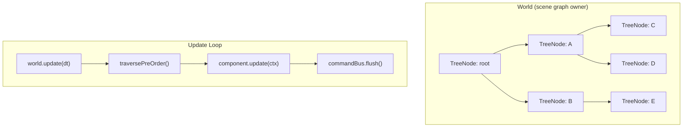
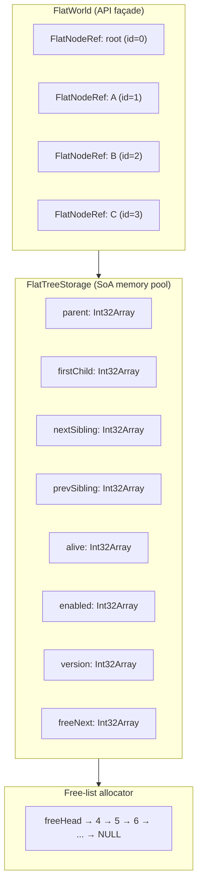

# Architecture

## What This Repo Is

This repository is a **prototype state-management kernel for a React Native game engine**. It is the pure-TypeScript foundation layer — the scene graph and update loop — that will eventually sit underneath a rendering pipeline powered by React Native Skia and React Native Reanimated.

React's lifecycle is reactive — it responds to state changes. Games are imperative — they run a continuous loop regardless of input. This repo solves that impedance mismatch by building the game logic layer in plain TypeScript first (testable, no device required), with the intent to integrate UI-thread rendering later.

The repo contains **two parallel implementations** of the same scene-graph concept:

- **`state_tree`** — The original object-graph implementation. Complete, well-tested, strongly encapsulated. Serves as the reference implementation and the behavioral specification.
- **`flat_tree`** — A data-oriented rewrite using struct-of-arrays (SoA) layout. Designed for cache-friendly traversal, zero-GC allocations, and future Reanimated/SharedArrayBuffer compatibility. Currently in active development.

| Metric | Value |
|---|---|
| Language | TypeScript (strict mode) |
| Test framework | Jest 30 + ts-jest |
| Tests | **101 passing, 13 todo, 0 failing** |
| Dependencies | **Zero runtime deps** |
| Build target | `es2016 → commonjs` |

---

## state_tree — Reference Implementation

### Overview

`state_tree` implements a World → TreeNode → Component scene-graph hierarchy, closely modeled after Unity's GameObject/MonoBehaviour pattern.



### Classes

#### `World` — [World.ts](file:///Users/casevanhouwelingen/WebstormProjects/react-native-game-engine-PROTO/src/state_tree/World.ts) (204 lines)

The central orchestrator. Owns the scene graph, a `Map<string, TreeNode>` lookup table, and the update loop.

**Structural mutations:** `attach(parent, child)`, `detach(node)`, `destroy(node)`, `reparent(node, newParent)`

**Update loop:** `update(dt)` → pre-order traversal → component updates → command bus flush

**Deferred mutations:** Structural mutations are available as direct World methods *and* as deferred commands through the `CommandBuffer`. During `update()`, components receive the `CommandBuffer` version to prevent mid-traversal graph corruption.

#### `TreeNode` — [Node.ts](file:///Users/casevanhouwelingen/WebstormProjects/react-native-game-engine-PROTO/src/state_tree/Node.ts) (77 lines)

A node in the scene graph. String ID, private parent/children with defensive copy getters, `@internal` structural methods (`setParent`, `addChild`, `removeChild`).

**Component system:** `addComponent<T>`, `getComponent<T>`, `hasComponent<T>` — generic, type-safe, one-per-type constraint. `onAttach()` lifecycle hook. Components receive `UpdateContext { world, commands, dt }` in `update()`.

**Enabled flag:** When `false`, the node and all its descendants are excluded from traversal (Unity-style propagation).

#### `Component` — [Component.ts](file:///Users/casevanhouwelingen/WebstormProjects/react-native-game-engine-PROTO/src/state_tree/Component.ts) (10 lines)

Abstract base class. `node!: TreeNode` back-reference set on attach. Optional `onAttach()` and `update(ctx)`.

#### `CommandBus` + `CommandBuffer` — [CommandBus.ts](file:///Users/casevanhouwelingen/WebstormProjects/react-native-game-engine-PROTO/src/state_tree/CommandBus.ts) (58 lines)

`CommandBus`: FIFO queue of `() => void` closures. `CommandBuffer`: Implements `WorldCommands` interface, wraps all four mutations as deferred closures.

### state_tree Invariants

1. Root always exists, has `id = "root"`, has `null` parent
2. Root cannot be attached, detached, destroyed, or reparented
3. No duplicate node IDs within a world
4. No node can have two parents (attach rejects already-parented nodes)
5. No cycles — reparent checks `isAncestor()` up the parent chain
6. No self-reparent — cannot reparent a node to itself
7. Ownership — mutations validate `this.owns(node)` before operating
8. Deferred mutations during update — components receive `CommandBuffer`, not `World`
9. Children/components getters return defensive copies
10. `enabled = false` propagates to all descendants during traversal

---

## flat_tree — Data-Oriented Rewrite (In Progress)

### Overview

`flat_tree` reimplements the same scene-graph concept using struct-of-arrays (SoA) layout. All node data lives in contiguous `Int32Array` buffers indexed by integer slot IDs. A Façade layer (`FlatWorld` + `FlatNodeRef`) provides an ergonomic OOP-like API over the raw arrays.



### Classes

#### `FlatTreeStorage` — [FlatTreeStorage.ts](file:///Users/casevanhouwelingen/WebstormProjects/react-native-game-engine-PROTO/src/flat_tree/FlatTreeStorage.ts) (105 lines)

The memory pool. 8 parallel `Int32Array` columns:

| Array | Purpose |
|---|---|
| `parent[id]` | Parent slot index (or `NULL = -1`) |
| `firstChild[id]` | Head of child linked list |
| `nextSibling[id]` | Next sibling in doubly-linked list |
| `prevSibling[id]` | Previous sibling in doubly-linked list |
| `alive[id]` | 1 if slot is occupied, 0 if free |
| `enabled[id]` | 1 if node is active |
| `version[id]` | Generation counter for stale-reference detection |
| `freeNext[id]` | Next slot in the free list |

**Allocation:** Fixed capacity. Slot 0 reserved for root. Slots 1..capacity-1 form a singly-linked free list. `allocate()` pops from head, bumps version. `free()` pushes back (LIFO reuse).

**Children structure:** Doubly-linked list via `firstChild`/`nextSibling`/`prevSibling`. O(1) attach (head insert), O(1) detach (linked-list splice). This is a meaningful upgrade from state_tree's `Array.filter()` which is O(n) per detach.

#### `FlatWorld` — [FlatWorld.ts](file:///Users/casevanhouwelingen/WebstormProjects/react-native-game-engine-PROTO/src/flat_tree/FlatWorld.ts) (119 lines)

The public API façade. Owns a **private** `FlatTreeStorage`.

**Implemented:** `createNode()`, `attach(child, parent)`, `detach(child)`, `getParent(ref)`, `getChildren(ref)`, `isEnabled(ref)`, `setEnabled(ref, value)`, `isAlive(ref)`, `assertValidRef(ref)`, `assertInWorld(ref)`

**Not yet implemented:** `destroy`, `reparent`, `traversePreOrder`, `update`, `CommandBus`, components

#### `FlatNodeRef` — [FlatNodeRef.ts](file:///Users/casevanhouwelingen/WebstormProjects/react-native-game-engine-PROTO/src/flat_tree/FlatNodeRef.ts) (32 lines)

A lightweight generational handle: `(world, id, version)`. Delegates everything to `FlatWorld`. Provides `enabled` getter/setter, `equals()` for reference comparison, `belongsTo(world)` for ownership verification. Created on the fly by `getParent()`/`getChildren()` — these are ephemeral wrappers, not long-lived objects.

**Generational indices:** The `(id, version)` pattern (borrowed from Rust game engines: Bevy, hecs, legion) prevents use-after-free bugs. When a slot is freed and reallocated, any old `FlatNodeRef` pointing to that slot will fail `assertValid()` because the version no longer matches.

### flat_tree Invariants

1. Root is slot 0, always alive, version = 1, cannot be freed
2. All methods validate world ownership via `assertInWorld()` before operating
3. All methods validate aliveness + version match via `assertValidRef()`
4. `attach` rejects: root as child, self-attach, already-parented child, cross-world refs
5. `detach` rejects: root, parentless node, cross-world refs
6. `isAlive()` is non-throwing for dead/stale nodes (returns `false`), only throws for wrong world
7. `getParent()`/`getChildren()` create `FlatNodeRef` instances on the fly with correct versions
8. Freed slots are returned to the free list (LIFO) and reusable with bumped version
9. Storage is private — no external access to raw arrays
10. Sibling list integrity: head-insert on attach, proper prev/next relinking on detach

### Key Design Decision: The Façade Pattern

The user interacts with `FlatNodeRef` as if it were a real OOP object:
```typescript
const player = world.createNode();
player.enabled = false;
```

Under the hood, this routes to `this._storage.enabled[player.id] = 0`. The developer doesn't need to know about flat arrays. This gives DOD performance with OOP ergonomics — the same pattern Unity DOTS uses.

---

## Comparison: state_tree vs flat_tree

| Dimension | `state_tree` | `flat_tree` |
|---|---|---|
| **Data layout** | Object graph — heap-allocated class instances | SoA — contiguous `Int32Array` columns |
| **Node identity** | String ID (`"player"`) | Integer slot index + generation version |
| **Children** | `Array<TreeNode>` (dynamic) | Doubly-linked list (O(1) insert/remove) |
| **Child removal** | `Array.filter()` — O(n) | Linked-list splice — O(1) |
| **Allocation** | `new TreeNode()` — heap, GC-managed | Free-list pop — no heap alloc |
| **Stale refs** | None — destroyed refs stay "valid" | Generational index — stale refs detected |
| **Encapsulation** | Private fields, defensive copies | Private storage, public query methods, ownership checks |
| **Components** | Full — abstract class, lifecycle hooks | Not implemented |
| **Update loop** | Full — traverse → update → flush | Not implemented |
| **Command bus** | Full — deferred mutation queue | Not implemented |
| **Destroy** | Recursive subtree destroy + cleanup | Not implemented |
| **Reparent** | Full with cycle detection | Not implemented |
| **Cache behavior** | Poor — pointer chasing | Excellent — linear array scans |
| **Maturity** | Complete prototype (63 tests) | In progress (38 tests, 13 todo) |

---

## What Is Currently Tested

### state_tree — 63 passing

| Suite | Tests | Coverage |
|---|---|---|
| [node.test.ts](file:///Users/casevanhouwelingen/WebstormProjects/react-native-game-engine-PROTO/src/state_tree/__tests__/node.test.ts) | 4 | ID validation, starts parentless/childless, children defensive copy |
| [component.test.ts](file:///Users/casevanhouwelingen/WebstormProjects/react-native-game-engine-PROTO/src/state_tree/__tests__/component.test.ts) | 7 | Back-reference, type retrieval, onAttach, defensive copy, fluent API, duplicate rejection |
| [command.test.ts](file:///Users/casevanhouwelingen/WebstormProjects/react-native-game-engine-PROTO/src/state_tree/__tests__/command.test.ts) | 14 | CommandBus FIFO (6), CommandBuffer deferred attach/detach/destroy/reparent (8) |
| [traversal.test.ts](file:///Users/casevanhouwelingen/WebstormProjects/react-native-game-engine-PROTO/src/state_tree/__tests__/traversal.test.ts) | 8 | Pre-order DFS, root-only/flat/nested, disabled propagation, determinism, non-mutation |
| [world.test.ts](file:///Users/casevanhouwelingen/WebstormProjects/react-native-game-engine-PROTO/src/state_tree/__tests__/world.test.ts) | 27 | Root (2), attach (5), detach (4), destroy (4), reparent (5), node lookup (7) |
| [integration.test.ts](file:///Users/casevanhouwelingen/WebstormProjects/react-native-game-engine-PROTO/src/state_tree/__tests__/integration.test.ts) | 3 | Counter accumulation, self-destruction via CommandBuffer, unattached skip |

### flat_tree — 38 passing, 13 todo

| Suite | Tests | Coverage |
|---|---|---|
| [flat-storage.test.ts](file:///Users/casevanhouwelingen/WebstormProjects/react-native-game-engine-PROTO/src/flat_tree/__tests__/flat-storage.test.ts) | 13 + 1 todo | Root init (alive, version=1, enabled=1, NULL pointers), sequential allocation, alive marking, capacity exhaustion, capacity=1 root, free marks dead, free+realloc version bump, stale version rejection, cannot free root/dead |
| [flat-world-basic.test.ts](file:///Users/casevanhouwelingen/WebstormProjects/react-native-game-engine-PROTO/src/flat_tree/__tests__/flat-world-basic.test.ts) | 24 + 9 todo | Root ref validity, createNode, enabled default, getParent/getChildren, getParent null for root, cross-world rejection (getParent, getChildren, isAlive, attach child, attach parent, detach), isAlive, attach (parent link, firstChild, head-insert order), detach (clear parent, first/middle/last/only child), cannot attach root/self/double-parented, cannot detach root/parentless |
| flat-command.test.ts | placeholder | — |
| flat-traversal.test.ts | placeholder | — |
| flat-destroy-reparent.test.ts | placeholder | — |

---

## File Tree

```
src/
├── index.ts                         # Barrel — exports World, Component, UpdateContext, WorldCommands
├── state_tree/
│   ├── types.ts                     # WorldCommands interface, UpdateContext type
│   ├── Component.ts                 # Abstract base class for game behaviors
│   ├── Node.ts                      # TreeNode — scene graph node with component container
│   ├── World.ts                     # Scene graph owner, update loop, mutation API
│   ├── CommandBus.ts                # Deferred mutation queue (CommandBus + CommandBuffer)
│   └── __tests__/                   # 63 tests across 6 suites
└── flat_tree/
    ├── constants.ts                 # NULL = -1, ROOT_ID = 0
    ├── FlatTreeStorage.ts           # SoA memory pool — 8 Int32Array columns + free-list allocator
    ├── FlatWorld.ts                 # API façade — private _storage, mutations, query methods
    ├── FlatNodeRef.ts               # Generational handle — (world, id, version)
    ├── FlatCommandBus.ts            # Empty stub
    ├── types.ts                     # Empty stub
    └── __tests__/                   # 38 tests + 13 todo across 5 suites
```
