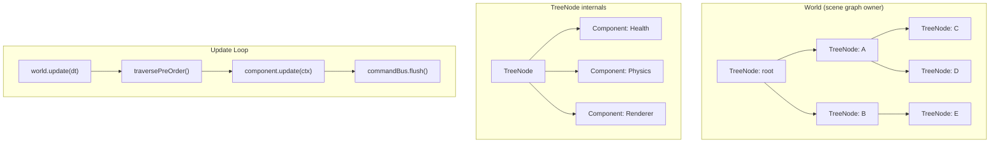

# react-native-game-engine-PROTO — Architecture Document

## What This Is

This repository is a **prototype state-management kernel for a React Native game engine**. It is *not* a game, and it is *not* yet connected to React Native. It is the pure-TypeScript foundation layer — the scene graph and update loop — that will eventually sit underneath a rendering pipeline powered by [React Native Skia](https://shopify.github.io/react-native-skia/) and [React Native Reanimated](https://docs.swmansion.com/react-native-reanimated/).

**The core idea:** React's lifecycle is reactive — it responds to state changes. Games are imperative — they run a continuous loop regardless of input. The author has shipped multiple RN games already, fought that impedance mismatch firsthand, and is now extracting the hard-won architectural patterns into a reusable framework. The strategy is to get the logic layer right in plain TypeScript (testable, no device required), then integrate the UI-thread rendering later.

---

## Repository Stats

| Metric | Value |
|---|---|
| Language | TypeScript (strict mode) |
| Test framework | Jest 30 + ts-jest |
| Source files | 5 (+ 1 barrel `index.ts`) |
| Test files | 6 |
| Tests | **47 passing, 0 failing** |
| Dependencies | **Zero runtime deps** — devDependencies only |
| Commits | 9 (linear, incremental) |
| Build target | `es2016 → commonjs` |

---

## Architecture Overview

The entire codebase lives in `src/state_tree/` and implements a **scene-graph with component composition** — conceptually similar to Unity's `GameObject`/`MonoBehaviour` model or a simplified Entity-Component-System (ECS).



### The Four Core Classes

#### 1. `World` — [World.ts](file:///Users/casevanhouwelingen/WebstormProjects/react-native-game-engine-PROTO/src/state_tree/World.ts) (183 lines)

The central orchestrator. Owns the scene graph, the node lookup table, and the update loop.

**Key responsibilities:**
- Creates and owns the `root` TreeNode
- Maintains a `Map<string, TreeNode>` for O(1) node lookup by ID
- Exposes four structural mutation methods: `attach`, `detach`, `destroy`, `reparent`
- Runs the game loop via `update(dt)`: pre-order traversal → component updates → command flush
- Enforces invariants: no duplicate IDs, no cycles, no orphaned mutations, root is immutable

**Design decision worth noting:** Structural mutations (`attach`, `detach`, `destroy`, `reparent`) are available both as direct `World` methods *and* as deferred commands through the `CommandBuffer`. During `update()`, components receive the deferred `CommandBuffer` version — this prevents the tree from being modified mid-traversal.

#### 2. `TreeNode` — [Node.ts](file:///Users/casevanhouwelingen/WebstormProjects/react-native-game-engine-PROTO/src/state_tree/Node.ts) (77 lines)

A node in the scene graph. Holds its identity, hierarchy links, and attached components.

**Key characteristics:**
- `id` is `readonly` and validated (non-empty string)
- Parent/children are private — exposed via getters that return copies (immutable from outside)
- `setParent`, `addChild`, `removeChild` are marked `@internal` — intentionally public for `World` to call, but documented as "don't touch this directly"
- Component system: `addComponent<T>`, `getComponent<T>`, `hasComponent<T>` — generic, type-safe, one-per-type constraint
- `enabled` flag exists for skipping disabled nodes during traversal

#### 3. `Component` — [Component.ts](file:///Users/casevanhouwelingen/WebstormProjects/react-native-game-engine-PROTO/src/state_tree/Component.ts) (10 lines)

An abstract base class for game behavior. Minimal by design.

```typescript
export abstract class Component {
    node!: TreeNode;          // back-reference, set on attach
    onAttach?(): void;        // lifecycle hook
    update?(ctx: UpdateContext): void;  // per-frame logic
}
```

Components are pure behavior containers. They get a back-reference to their owning node on attach, optionally initialize in `onAttach`, and optionally run per-frame logic in `update`. The `UpdateContext` provides `world`, `commands` (the deferred `CommandBuffer`), and `dt`.

#### 4. `CommandBus` + `CommandBuffer` — [CommandBus.ts](file:///Users/casevanhouwelingen/WebstormProjects/react-native-game-engine-PROTO/src/state_tree/CommandBus.ts) (58 lines)

A deferred execution system. This is the key architectural insight of the whole repo.

- **`CommandBus`**: A simple FIFO queue of `() => void` closures. Enqueue during traversal, flush after.
- **`CommandBuffer`**: Implements the `WorldCommands` interface. Wraps `World.attach/detach/destroy/reparent` in closures and enqueues them on the bus. This is what components receive during `update()`.

**Why this matters:** If a component calls `world.destroy(someNode)` during traversal, the node disappears mid-iteration — classic concurrent modification bug. The `CommandBuffer` defers the mutation until traversal is complete. This is a well-known pattern in game engines (Unity does exactly this with `Destroy()` vs immediate removal).

---

## What Is Being Tested (Strictly)

All **47 tests pass**. Here is what each suite covers:

### [node.test.ts](file:///Users/casevanhouwelingen/WebstormProjects/react-native-game-engine-PROTO/src/__tests__/node.test.ts) — 4 tests
- ID is required and validated
- Starts parentless and childless
- `children` getter returns a defensive copy (mutation-safe)

### [component.test.ts](file:///Users/casevanhouwelingen/WebstormProjects/react-native-game-engine-PROTO/src/__tests__/component.test.ts) — 6 tests
- `addComponent` sets the back-reference and registers the component
- `getComponent` retrieves by type, returns `undefined` for missing
- `onAttach` lifecycle fires on add
- `components` getter returns a defensive copy
- Duplicate component types are rejected

### [command.test.ts](file:///Users/casevanhouwelingen/WebstormProjects/react-native-game-engine-PROTO/src/__tests__/command.test.ts) — 6 tests
- Commands enqueue without executing
- Commands execute on flush, in FIFO order
- Queue clears after flush
- Empty flush is safe

### [traversal.test.ts](file:///Users/casevanhouwelingen/WebstormProjects/react-native-game-engine-PROTO/src/__tests__/traversal.test.ts) — 6 tests
- Pre-order DFS includes root
- Handles root-only, flat, and nested trees
- Deterministic across repeated calls
- Does not mutate the tree structure

### [world.test.ts](file:///Users/casevanhouwelingen/WebstormProjects/react-native-game-engine-PROTO/src/__tests__/world.test.ts) — 24 tests
The largest and most thorough suite. Covers:
- **Root creation**: exists, has null parent
- **`attach`**: sets parent/child links, rejects attaching root, rejects nodes with existing parents, rejects foreign nodes
- **`detach`**: clears links, rejects foreign nodes, rejects root
- **`destroy`**: removes from parent, clears parent, rejects foreign/root, recursively destroys children
- **`reparent`**: moves between parents correctly, rejects foreign nodes, rejects root, **detects and prevents cycles**
- **Node lookup**: root is registered, attach registers, destroy/detach unregisters descendants, detach+re-attach restores subtree registration, duplicate IDs are rejected

### [integration.test.ts](file:///Users/casevanhouwelingen/WebstormProjects/react-native-game-engine-PROTO/src/__tests__/integration.test.ts) — 1 test
Placeholder (`expect(true).toBe(true)`). Slot reserved for future end-to-end scenarios.

---

## What Stands Out

### 1. Test-Driven From Day One
The git history tells a clear story: every commit adds a feature *and* its tests together. This isn't "tests added after the fact" — it's genuine TDD. The commit messages even enumerate which test cases were added. For a prototype repo, this is unusually disciplined.

### 2. The CommandBuffer Pattern
This is the most architecturally interesting piece. Most hobby game engines get this wrong — they let components mutate the world during traversal and discover the bug 200 hours in when something intermittently crashes. The fact that this was designed in from the start (commit history shows it was introduced alongside the traversal/update loop) shows real experience with game engine pitfalls.

### 3. Defensive API Design
- Children/components getters return copies, not internal arrays
- Structural mutations on `TreeNode` are `@internal`-documented
- Every mutation validates ownership, existence, and graph invariants (no cycles, no duplicate IDs, no orphan reparenting)
- Root is fully protected — can't be attached, detached, destroyed, or reparented

### 4. Zero Runtime Dependencies
This is a pure TypeScript library with no external runtime dependencies. Only devDependencies (Jest, TypeScript, ts-jest). This is intentional — the engine core should have no platform coupling.

### 5. The Architecture Mimics Established Game Engine Patterns
The World/Node/Component hierarchy maps closely to:
- **Unity**: Scene → GameObject → MonoBehaviour
- **Godot**: SceneTree → Node → Script
- **Bevy (Rust)**: World → Entity → Component (though Bevy is pure ECS, not scene-graph)

The `UpdateContext` providing `{ world, commands, dt }` is basically a minimal version of what every game engine passes to its update functions.

---

## Where This Is Going

Based on the README, git history, and related `sheeps-app` project:

1. **Next immediate step**: Real integration tests — the placeholder file is waiting. Likely testing multi-component interactions, e.g., "a `Health` component that destroys its node when HP reaches 0 via the `CommandBuffer`."

2. **Systems layer**: Right now, components own their own `update()`. A natural next step is a Systems layer (functions that query for nodes with specific component combinations and batch-process them). This would move from "Unity-style" to "ECS-style."

3. **Event system**: There's no inter-component communication mechanism yet. Components can read each other via `node.getComponent()`, but there's no event bus or signal system. Games need this for things like "player scored" or "collision detected."

4. **React Native Skia integration**: The README explicitly states the end goal — Skia for rendering, Reanimated for running on the UI thread. The current architecture is designed to be platform-agnostic so this layer can be added on top.

5. **Consumed by `sheeps-app`**: The user's other project (`sheeps-app`) appears to be a React Native game that will consume this engine. The engine is being extracted *from* real game code, not designed in a vacuum.

---

## Strengths

| Strength | Detail |
|---|---|
| **Deferred mutations** | The `CommandBuffer` pattern prevents mid-traversal graph corruption — a solved problem that most hobby engines never solve |
| **Immutable external API** | Getters return copies; internal state can't be corrupted by consumers |
| **Comprehensive validation** | Every mutation has guard clauses with descriptive error messages. The engine fails fast and loud |
| **Test coverage** | 47 tests covering happy paths, error paths, edge cases, and invariant preservation. Well-organized by concern |
| **Zero coupling** | No React, no RN, no platform code. Pure logic. Testable anywhere |
| **Incremental, linear git history** | Each commit is a self-contained feature + tests. Easy to review and bisect |
| **TypeScript strict mode** | Catches entire categories of bugs at compile time |

## Weaknesses

| Weakness | Detail |
|---|---|
| **No systems/query layer** | Components update themselves individually. There's no way to say "run physics on every node that has a `RigidBody`." This will become painful as game complexity grows |
| **No event/messaging system** | Components can't communicate except by walking the tree. No pub/sub, no signals, no event bus |
| **`@internal` methods are still `public`** | TypeScript doesn't have a true `internal` access modifier. `setParent`, `addChild`, `removeChild` on `TreeNode` are public and can be misused. A `Symbol`-based or `friend`-pattern approach could enforce this |
| **No component removal** | You can `addComponent` but there's no `removeComponent`. Once attached, a component lives forever on that node |
| **No lifecycle beyond `onAttach`** | No `onDetach`, `onDestroy`, `onEnable`, `onDisable` hooks. Components can't clean up resources |
| **`traversePreOrder` allocates a new array every frame** | Fine for prototyping, but for 60fps on mobile this will create GC pressure. A visitor/callback pattern or reusable buffer would be more performant |
| **Linear scan for `getComponent`** | `Array.find()` with `instanceof` check. Fine for small component counts, but could be replaced with a `Map<Constructor, Component>` for O(1) lookup |
| **No serialization** | No way to save/load a world. This matters for level design, save games, and debugging |
| **Integration test is empty** | The integration test file exists but contains only a placeholder |
| **`index.ts` exports nothing** | The barrel file just logs to console — no public API is exported yet |

---

## File Tree (Annotated)

```
react-native-game-engine-PROTO/
├── src/
│   ├── index.ts                    # Barrel file (currently just console.log)
│   ├── state_tree/
│   │   ├── types.ts                # WorldCommands interface, UpdateContext type
│   │   ├── Component.ts            # Abstract base class for game behaviors
│   │   ├── Node.ts                 # TreeNode — scene graph node with component container
│   │   ├── World.ts                # Scene graph owner, update loop, mutation API
│   │   └── CommandBus.ts           # Deferred mutation queue (CommandBus + CommandBuffer)
│   └── __tests__/
│       ├── node.test.ts            # 4 tests — TreeNode construction and immutability
│       ├── component.test.ts       # 6 tests — Component lifecycle and type safety
│       ├── command.test.ts         # 6 tests — CommandBus FIFO and flush behavior
│       ├── traversal.test.ts       # 6 tests — Pre-order DFS correctness
│       ├── world.test.ts           # 24 tests — Mutations, lookups, invariants
│       └── integration.test.ts     # 1 test  — Placeholder for end-to-end scenarios
├── package.json                    # Zero runtime deps, Jest + TypeScript devDeps
├── tsconfig.json                   # Strict mode, ES2016, CommonJS output
├── jest.config.js                  # ts-jest transform
└── README.md                       # Author's motivation and technical context
```

---

## For Prompt Context (Gemini)

If you're providing this to Gemini as context, here's the key framing:

> This repo is a **work-in-progress, pure-TypeScript game engine core** — specifically the state/scene-graph layer. It implements a `World` → `TreeNode` → `Component` hierarchy with a `CommandBus` for deferred structural mutations. It is test-driven (47/47 passing), has zero runtime dependencies, and is designed to eventually integrate with React Native Skia + Reanimated for mobile game rendering. The architecture mirrors Unity/Godot patterns intentionally. Current gaps include: no systems/query layer, no event system, no component removal, no lifecycle hooks beyond `onAttach`, and no rendering. The author is actively building games on top of this (see: `sheeps-app`).
